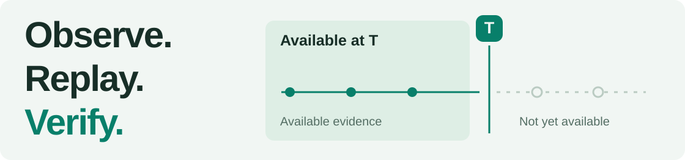
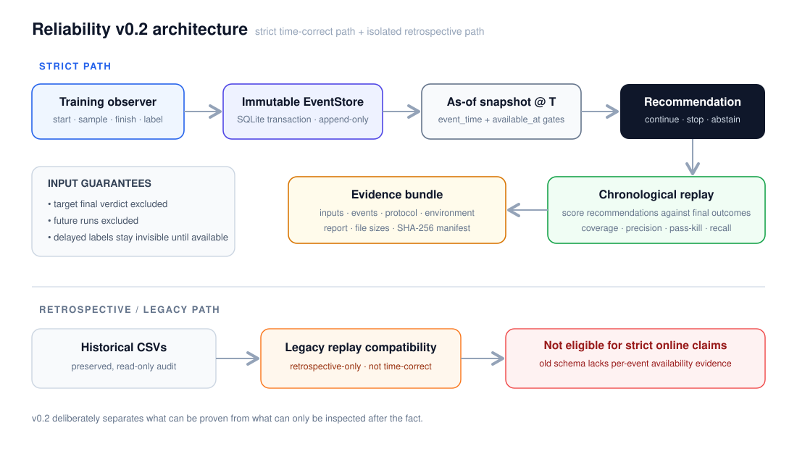

# RL Sentinel

<picture>
  <source media="(prefers-color-scheme: dark)" srcset="docs/assets/sentinel-hero-dark.svg" />
  
</picture>

**A recommendation-only reliability layer for reinforcement-learning experiments.**
Record training observations, reconstruct what was available at a decision point, and review the recommendation alongside its evidence.

<p><code>Python 3.12+</code> · <code>stdlib runtime</code> · <a href="https://github.com/Anhao1314/RL-Sentinel/actions">CI / Actions ↗</a></p>

[Quick start](#quick-start) · [Results](#results) · [Integration](#integration) · [Documentation](docs/README.md) · [简体中文](README.zh-CN.md)

> RL Sentinel produces local recommendations. It does not automatically stop training. The current experiment demonstrates a controlled workflow, not production early-stop effectiveness.

<a id="quick-start"></a>
## Run your first experiment

Use **Python 3.12+**. The strict core runs directly from the checkout, without a GPU, API key or third-party runtime packages.

<!-- sentinel:quickstart -->
```bash
git clone https://github.com/Anhao1314/RL-Sentinel.git
cd RL-Sentinel
python -m rl_risk_replay experiment --out artifacts/sentinel-demo
python -m rl_risk_replay verify --bundle artifacts/sentinel-demo
```
<!-- /sentinel:quickstart -->

Open `artifacts/sentinel-demo/report.html` in a browser. The command runs **18 actual Q-learning trials**, then compares three recommendation policies. The output directory must be new; existing evidence is never overwritten.

The repository name is **RL-Sentinel**. The Python module remains **`rl_risk_replay`** for compatibility. [Installation, output files and troubleshooting →](docs/GETTING_STARTED.md)

## What you can use it for

**Review a training run.** Inspect the observations and historical examples available when a recommendation was made, rather than starting from its eventual outcome.

**Compare recommendation policies.** Replay rules, always-continue and always-stop against the same runs. Keep missed failures, false stops and abstentions visible.

**Share an auditable experiment.** Keep the event stream, decision inputs, configuration and results together in a bundle with a file manifest and hashes.

<a id="time-boundary"></a>
## The boundary that matters

An event can happen before it becomes available. A report generated after a decision must not influence that earlier decision, even when it describes an earlier training step.

RL Sentinel checks **both `event_time` and `available_at`**. Target outcomes are used for scoring, not as predictor inputs. Eligible history is frozen at the target run's start.

<details>
<summary><strong>See the observation → decision → evidence flow</strong></summary>

<picture>
  <source media="(max-width: 600px)" srcset="docs/assets/replay-pipeline-mobile.svg" />
  
</picture>

This is an interface boundary for trusted producers and predictors, not a sandbox against malicious code. [Event fields, label precedence and time semantics →](docs/RELIABILITY_V2.md)

</details>

<a id="results"></a>
## What the experiment found

**Recorded validation: October 6, 2026, v0.2.** Six seeds, three conditions, 4,000 training steps per run, one 4×4 grid. Final evaluation uses 30 episodes with a different random-number stream. This is controlled fault injection, not a held-out Go2W benchmark. [Protocol and original evidence →](docs/VALIDATION_V2_2026-10-06.md)

The normal condition produced 6 passes. Disabling learning and resetting the policy at 55% of the budget produced 6 failures each. At the **70% checkpoint**:

| Policy | Failures identified | Successful runs stopped | Decision coverage |
| --- | ---: | ---: | ---: |
| Always continue | 0 / 12 | 0 / 6 | 18 / 18 |
| Always stop | 12 / 12 | 6 / 6 | 18 / 18 |
| **Rules-v2** | **6 / 12** | **0 / 6** | **17 / 18** |

**The useful finding is also a limitation:** rules-v2 detected the six late policy-reset failures but missed all six disabled-learning failures. It abstained on one run. At 30% and 50%, it stopped none.

Zero false stops among six successful runs does **not** establish a zero population error rate. All controlled results remain `readiness: blocked`; no realized compute savings are claimed.

<details>
<summary><strong>Validation scope and reproducible checks</strong></summary>

The same v0.2 validation record reports **62 core test methods + 25 subtests on each of Linux and Windows**, **265 historical regression tests on Linux**, and passing required strict-core Pyright. Cross-platform repetitions are not additional distinct tests.

All **200 future-data mutations** preserved historical input hashes and recommendations. Changing already-visible data changed both, providing a negative control. These are scoped tests, not a formal proof of all possible inputs.

```bash
python -m pip install -r requirements-core-dev.txt
python -m pytest tests_v2/ -q
python -m pyright --project pyright-core.json
python scripts/validate_reliability_v2.py --out artifacts/core-validation
```

The full historical suite needs `requirements-dev.txt`. Full-repository typing remains advisory with known debt; the required type gate applies to `rl_risk_replay/`.

</details>

<a id="integration"></a>
## Bring your own training observations

Use `EventStore.record` in a trusted observer to record `start`, increasing-step `sample`, `finish` and `label` events separately. Record labels only when evaluation or review actually produces them. This is an event API, not a prebuilt SB3, ROS or remote-cluster integration.

For an existing event database:

```bash
python -m rl_risk_replay replay --db artifacts/training.sqlite --out artifacts/training-review
```

[Connect an observer →](docs/GETTING_STARTED.md#integration) · [Full event contract →](docs/RELIABILITY_V2.md)

<a id="boundaries"></a>
## Scope and compatibility

**Strict v0.2 path:** validated events, time-gated inputs, explicit decision metrics, transactional SQLite batches and checksummed evidence bundles. The rule subset is not a complete migration of historical rules; probabilities are not calibrated.

**Historical path:** old CSVs, manual labels and reports are preserved. Their missing availability timestamps are not inferred. No historical run currently qualifies for strict replay; legacy Python APIs retain known retrospective leakage. Old replay CLIs require `--legacy-retrospective`.

**Not established:** production-safe intervention, cross-task predictive generalization, large-scale ingestion or authenticated provenance. Hashes detect changes relative to a manifest; they are not signatures. Comparable producer clocks and valid run identities remain requirements.

[Browse the documentation →](docs/README.md) · [Migration and remaining work →](docs/RELIABILITY_V2.md) · [Source code →](rl_risk_replay/)

---

Maintained by [Anhao1314](https://github.com/Anhao1314). The rename changes the project identity, not the Python import path, historical evidence or licensing status.
