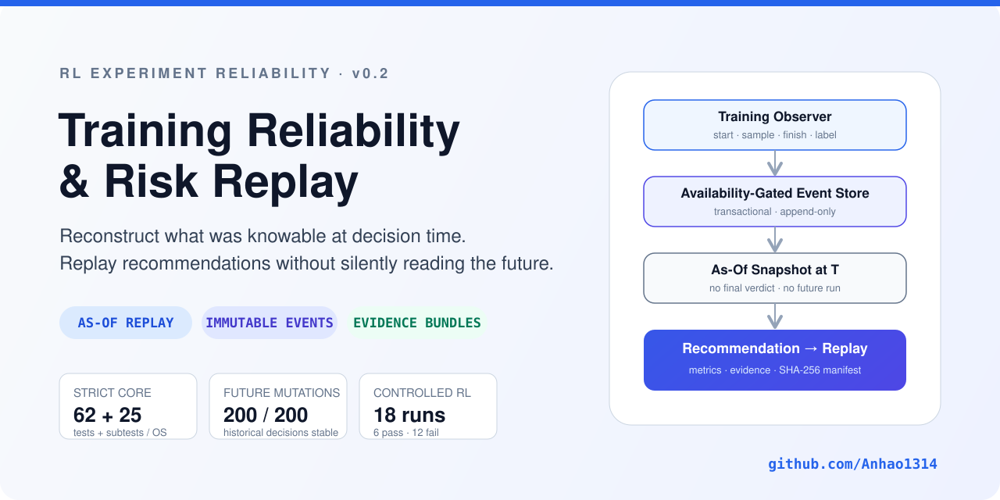

# RL Training Reliability & Risk Replay

<p align="center">
  
</p>

<p align="center">
  <a href="https://github.com/Anhao1314/rl-training-risk-replay/actions/workflows/ci.yml"></a>
  
  
  
</p>

<p align="center">
  <strong>Time-correct replay and evidence infrastructure for reinforcement-learning experiments.</strong><br/>
  Reconstruct what was actually knowable at decision time, issue recommendation-only risk decisions, and measure them without silently reading the future.
</p>

<p align="center">
  <a href="README.zh-CN.md">中文</a> ·
  <a href="docs/RELIABILITY_V2.md">Protocol & migration</a> ·
  <a href="docs/VALIDATION_V2_2026-10-06.md">v0.2 validation</a> ·
  <a href="docs/portfolio-validation.md">Historical validation</a>
</p>

---

## Why this exists

RL experiments often fail long before anyone notices. More subtly, post-hoc analysis can look excellent simply because the code accidentally saw the final verdict, a later run, or telemetry that was not available yet.

This project treats **training reliability as a separate systems problem**:

| Time-correct replay | Decision quality | Inspectable evidence |
| --- | --- | --- |
| Build an as-of view from immutable events using both event time and availability time. | Separate stop precision, false-stop share, pass-kill rate, failure recall, coverage and abstention. | Publish event streams, exact decision inputs, protocol, environment, reports and SHA-256 manifests. |

The current system is **recommendation-only**. It does not stop training automatically.

## Verified v0.2 snapshot

Validation date: **2026-10-06**. These are measured results for the v0.2 candidate that was merged into `main`, not permanent marketing claims.

| Check | Measured result |
| --- | --- |
| Strict core, Linux | **62 test methods + 25 subtests passed**, required strict Pyright passed |
| Strict core, Windows | **62 test methods + 25 subtests passed**, required strict Pyright passed |
| Historical regression | **265 tests passed** on Linux |
| Future-information mutation test | **200 / 200** future mutations left historical input hashes and recommendations unchanged |
| Controlled RL experiment | **18 actual Q-learning runs**: 6 pass / 12 fail |
| Rules-v2 at 70% budget | caught **6 / 12 failures**, killed **0 / 6 passes**, abstained on **1 / 18** |
| Historical Go2W data | **0 runs** qualify for strict replay because legacy rows lack availability-time evidence |

> The controlled experiment is deliberately small. It validates the replay and evidence chain, **not production early-stop effectiveness or Go2W generalization**. Full details: [validation record](docs/VALIDATION_V2_2026-10-06.md).

## Architecture

<p align="center">
  
</p>

The strict path is intentionally narrow:

```text
training observer
    ↓
immutable start / sample / finish / label events
    ↓
transactional SQLite EventStore
    ↓
as-of snapshot at cutoff T
    ↓
recommendation policy
    ↓
chronological replay against outcomes
    ↓
metrics + evidence bundle
```

Legacy CSV analysis remains available, but it is isolated as **retrospective-only** because its old schema cannot reconstruct when every field became available.

## Run the complete controlled experiment

Python **3.12+**. No GPU and no third-party runtime dependencies are required for the strict core.

```bash
python -m pip install -r requirements-core-dev.txt
python -m pip install --no-deps -e .

python -m rl_risk_replay experiment --out artifacts/controlled-run
python -m rl_risk_replay verify --bundle artifacts/controlled-run
```

Open:

```text
artifacts/controlled-run/report.html
```

The new directory contains:

```text
report.html          offline human-readable report
results.json         metrics + per-decision evidence
events.jsonl         immutable experiment event stream
q_tables.json        final learned Q tables
protocol.json        exact controlled-experiment protocol
manifest.json        members, sizes and SHA-256 hashes
```

Existing output directories are rejected rather than overwritten.

## Core reliability contract

| Risk | v0.2 behavior |
| --- | --- |
| Future runs or final target metadata leak into a predictor | Target inputs use a strict field allowlist; final verdict and duration are excluded. |
| A label is assumed available when training ends | Finish and label are different events. A label participates only after its own `available_at`. |
| Late telemetry has an old step number | Both `event_time` and `available_at` are enforced. |
| Historical membership changes after the fact | Eligible historical runs and labels are frozen relative to the target start. |
| Missing evidence silently becomes “healthy” | Policies can abstain; coverage and abstention remain explicit. |
| “False kill rate” hides denominator ambiguity | `stop_precision`, `false_stop_share`, `pass_kill_rate`, and `fail_recall` are separate metrics. |
| Partial writes create mixed dataset versions | SQLite batches commit atomically or roll back. |
| Report files can be overwritten independently | Reports are staged, published to a new directory and verified against a manifest. |

## What the controlled experiment actually found

The experiment executes **6 seeds × 3 conditions × 4,000 environment steps** in the same 4×4 grid world. Final labels come from 30 post-training evaluation episodes using different evaluation RNG.

| Condition | Pass | Fail |
| --- | ---: | ---: |
| Normal learning | 6 | 0 |
| Learning disabled | 0 | 6 |
| Policy reset at 55%, then learning frozen | 0 | 6 |
| **Total** | **6** | **12** |

At the 70% checkpoint:

| Policy | Failure recall | Passes killed | Coverage |
| --- | ---: | ---: | ---: |
| Always continue | 0 / 12 | 0 / 6 | 18 / 18 |
| Always stop | 12 / 12 | 6 / 6 | 18 / 18 |
| **Rules-v2** | **6 / 12** | **0 / 6** | **17 / 18** |

The important result is not “zero false kills.” With only six successful samples, that would be a heroic misuse of arithmetic. The useful result is that rules-v2 detected the **late policy-destruction failures** and completely missed the six **never-learned failures**. That blind spot is preserved as a research target rather than tuned away after seeing the answers.

## Connect a new training run

Create an event store:

```bash
python -m rl_risk_replay init --db artifacts/training.sqlite
```

Record lifecycle and observations separately:

```bash
python -m rl_risk_replay record --db artifacts/training.sqlite --run-id run-001 \
  --kind start --payload '{"task":"go2w-navigation","seed":"1","planned_steps":2000000}'

python -m rl_risk_replay record --db artifacts/training.sqlite --run-id run-001 \
  --kind sample --payload '{"step":100000,"reward":15.2,"approx_kl":0.02}'

python -m rl_risk_replay record --db artifacts/training.sqlite --run-id run-001 \
  --kind finish --payload '{"status":"completed"}'

python -m rl_risk_replay record --db artifacts/training.sqlite --run-id run-001 \
  --kind label --payload '{"verdict":"pass","source":"evaluation"}'
```

Replay only what was knowable:

```bash
python -m rl_risk_replay replay \
  --db artifacts/training.sqlite \
  --out artifacts/replay-001
```

A restarted attempt gets a new run ID. Remote producers need comparable clocks. Future-dated events are rejected rather than “fixed” silently.

## Repository map

| Path | Role |
| --- | --- |
| `rl_risk_replay/` | strict v0.2 runtime: events, replay engine, metrics, storage, reporting |
| `tests_v2/` | strict-core, adversarial, storage and time-isolation tests |
| `scripts/validate_reliability_v2.py` | controlled RL + future-mutation + legacy-audit validation |
| `legacy/` | frozen historical replay implementation |
| `data/datasets/` | preserved historical CSV datasets |
| `docs/RELIABILITY_V2.md` | event protocol, API, migration and boundaries |
| `docs/VALIDATION_V2_2026-10-06.md` | measured v0.2 validation evidence |

## Evidence boundaries

What v0.2 **does support**:

- availability-gated as-of inputs within the tested event protocol;
- append-only label revisions and frozen historical membership;
- transactional storage and verifiable report bundles;
- cross-platform strict-core execution;
- a reproducible controlled RL failure-injection experiment.

What v0.2 **does not establish**:

- calibrated failure probability;
- production-safe autonomous stopping;
- realized GPU savings;
- cross-task or Go2W predictive generalization;
- authenticated provenance against a malicious producer;
- zero type debt across the historical repository.

The historical repository still has advisory type findings. Passing strict-core Pyright means the **new core** passed its required gate, not that old code magically achieved enlightenment overnight.

## Reproduce the validation

```bash
python -m pytest tests_v2/ -q
python -m pyright --project pyright-core.json
python scripts/validate_reliability_v2.py --out artifacts/reliability-v2
```

For the preserved historical suite:

```bash
python -m pip install -r requirements-dev.txt
python -m pytest tests/ -q
python scripts/validate_reliability_v2.py --include-legacy --out artifacts/legacy-validation
```

See the [full v0.2 validation record](docs/VALIDATION_V2_2026-10-06.md) for exact environments, first-run failures that were fixed, artifact hashes and claim boundaries.
