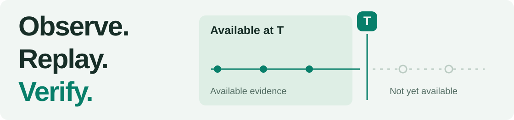
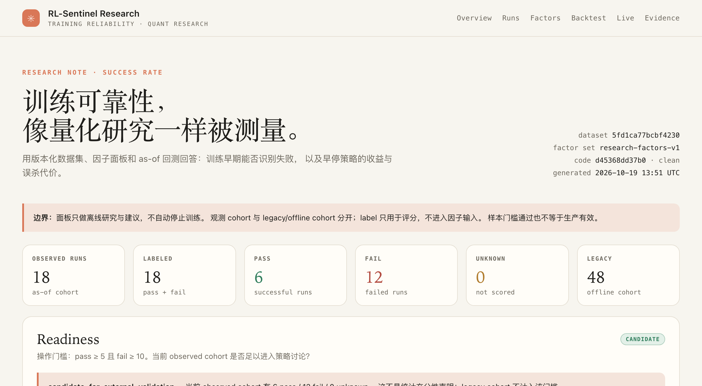
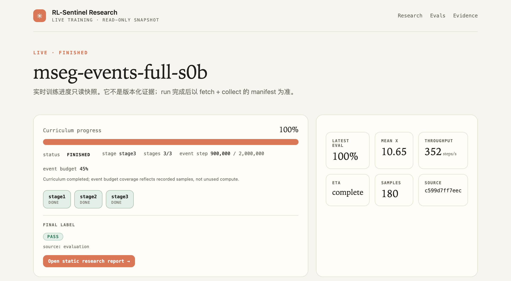

# RL Sentinel

<picture>
  <source media="(prefers-color-scheme: dark)" srcset="docs/assets/sentinel-hero-dark.svg" />
  
</picture>

**Training reliability, measured like quantitative research.**

RL Sentinel records what a reinforcement-learning run actually knew at each checkpoint, turns the record into a versioned research dataset, and reviews early-stop recommendations against the evidence available at the time.

<p><code>Python 3.12+</code> · <code>stdlib strict core</code> · <code>DuckDB + Parquet research layer</code> · <a href="https://github.com/Anhao1314/RL-Sentinel/actions">CI / Actions ↗</a></p>

[Quick start](#quick-start) · [Research system](#research-system) · [Live training](#live-training) · [Evidence](#evidence) · [Documentation](docs/README.md) · [简体中文](README.zh-CN.md)

> RL Sentinel produces local recommendations only. It does not stop training automatically. The controlled experiment demonstrates a workflow, not production early-stop effectiveness.



*Research note generated from the current Go2W dataset: 18 observed runs (6 pass / 12 fail) plus 48 legacy/offline runs. Observed readiness is `candidate_for_external_validation`; the rule backtest still misses most failures.*

## Why this exists

Most training dashboards answer a retrospective question: *what happened?* RL Sentinel answers a point-in-time question: **what was knowable at checkpoint T, and what decision did that justify?**

That distinction matters because early stopping is easy to get right with hindsight and hard to get right online. A run that eventually fails may look healthy at 50%; a run that eventually passes may have a temporary drawdown. The system therefore separates:

- **observed** runs with event-level timestamps, from
- **legacy/offline** runs without `available_at`, which never enter the operational gate.

Labels are used for scoring only. They are never factor inputs.

## What it does

| Layer | Responsibility | Main artifacts |
| --- | --- | --- |
| **Strict core** (`rl_risk_replay/`) | Event contract, as-of replay, decision policies, evidence bundles. Stdlib only. | SQLite, JSON, self-contained HTML |
| **Research layer** (`research/`) | Versioned dataset, checkpoint factors, cohort backtest, static research note, live page. | Parquet, DuckDB, HTML |
| **Producer adapters** | SB3 callback and Go2W run output. | `events.jsonl`, snapshot JSON |
| **Historical path** (`legacy/` and root modules) | Older CSV-based analyses, preserved for audit. | CSV, Markdown |

## Architecture

```text
training run
  events.jsonl + eval logs + acceptance summary + job spec
        │
        ├── rl_risk_replay/         strict event contract, as-of replay, evidence
        │
        └── research/
              dataset.py            versioned runs / events / labels / factors
                    │
              factors.py            24 checkpoint factors at 30 / 50 / 70 %
                    │
              backtest.py           rules-v2 vs always-continue / always-stop
                    │
              report.py             static research note
                    │
              live.py               read-only training snapshot page
```

The strict core has no third-party runtime dependencies. The research layer uses DuckDB, pandas, PyArrow, NumPy and SciPy; the two are intentionally separate.

<a id="quick-start"></a>
## Quick start

<!-- sentinel:quickstart -->
```bash
git clone https://github.com/Anhao1314/RL-Sentinel.git
cd RL-Sentinel
python -m rl_risk_replay experiment --out artifacts/sentinel-demo
python -m rl_risk_replay verify --bundle artifacts/sentinel-demo
```
<!-- /sentinel:quickstart -->

The demo runs 18 Q-learning trials under three conditions and compares three recommendation policies. Open `artifacts/sentinel-demo/report.html` in a browser. The output directory must be new; existing evidence is never overwritten.

Use Python 3.12+. The strict core needs no GPU, API key or third-party runtime package. The repository and display name are **RL Sentinel**; the Python module remains `rl_risk_replay` for compatibility.

<a id="research-system"></a>
## Research system

The research layer turns runs into a reproducible pipeline:

```text
versioned dataset → checkpoint factor panel → as-of cohort backtest → static report
```

### Versioned dataset

`research/dataset.py` writes `runs`, `events`, `eval_points`, `labels`, `factor_panel`, `factor_summary` and `factor_registry` as Parquet, plus `research.duckdb` and `manifest.json`.

`dataset_version` is a content hash over run inputs, labels, factor version, checkpoints and research source. Rebuilding the same inputs reuses the same version; existing versions are not overwritten.

### Factor panel

At 30%, 50% and 70% of each run's budget, the panel computes 24 factors using only samples with `step <= checkpoint_step`:

| Category | Factors |
| --- | --- |
| Convergence | reward_last, reward_peak, reward_drawdown, reward_slope, reward_neg_ratio |
| Stability | reward_std_recent |
| Health | kl_last, kl_mean_recent, kl_max_recent, kl_divergent_streak, value_loss_last, value_loss_slope |
| Progress | progress_last, progress_slope, step_coverage |
| Execution | success_rate_last, success_rate_slope, segment_last, segment_changes |
| Coverage | sample_count |
| Evaluation | eval_success_rate_last, eval_success_rate_slope, eval_mean_reward_last, eval_mean_x_last |

The label is never an input. Factor coverage and Spearman IC are reported only when the sample supports them; otherwise the result is `N/A`, not zero.

### As-of backtest

`research/backtest.py` replays three policies at each checkpoint:

- `always-continue` — never stop.
- `always-stop` — stop at every checkpoint.
- `rules-v2` — drawdown ≥ 0.30, KL ≥ 0.10, KL-divergent streak ≥ 3, or progress slope ≤ 0 with sufficient coverage.

The operational gate is deliberately strict: at least **5 passing** and **10 failing** labeled runs. Until then, readiness stays `blocked`. The current matrix meets the gate, so readiness is `candidate_for_external_validation`; that is a data-sufficiency result, not a claim that the rule works. The observed and legacy cohorts are reported separately; legacy rows have no event-time and never count toward the gate.

### Report and live page

`research/report.py` renders a self-contained HTML research note in a warm, Claude Code-inspired visual language: run explorer, learning signal, factor lab, backtest, readiness and evidence. No external scripts, fonts or images.

`research/live.py` renders a read-only page from a training snapshot. It refreshes every 15 seconds and shows curriculum progress, event-budget coverage, stage status, latest eval, throughput, ETA and the final label.

<a id="live-training"></a>
## Live training integration

The first producer is the Go2W wheeled quadruped in the MoRA-Train project. A training run writes `events.jsonl`; a Windows-side job runner can return a read-only snapshot without touching the run:

```text
Windows run directory
  → win_job_runner.py snapshot
  → snapshot JSON
  → research/live.py
  → research/reports/live/index.html
```



*The live page is diagnostic, not evidence. It never executes stop, tune or resize actions. The fetched run and its SHA-256 manifest remain authoritative.*

<a id="evidence"></a>
## Evidence

### Controlled fault injection (v0.2)

Six seeds, three conditions, 4,000 training steps per run, one 4×4 grid. The normal condition produced 6 passes; disabling learning and resetting the policy at 55% of the budget produced 6 failures each. At the 70% checkpoint:

| Policy | Failures identified | Successful runs stopped | Decision coverage |
| --- | ---: | ---: | ---: |
| Always continue | 0 / 12 | 0 / 6 | 18 / 18 |
| Always stop | 12 / 12 | 6 / 6 | 18 / 18 |
| **Rules-v2** | **6 / 12** | **0 / 6** | **17 / 18** |

Rules-v2 detected the six late policy-reset failures and missed all six disabled-learning failures; it abstained once. At 30% and 50%, it stopped none.

Zero false stops among six successful runs does **not** establish a zero population error rate. All controlled results remain `readiness: blocked`; no realized compute savings are claimed.

### Observed Go2W matrix (2026-10-19)

The current dataset `5fd1ca77bcbf4230` contains **18 observed runs (6 pass / 12 fail)** plus 48 legacy/offline runs. Readiness is `candidate_for_external_validation`: the cohort is now large enough for the gate, but not enough to claim operational effectiveness.

- Pass group: one full-budget run, two short-budget/no-BC pilots that unexpectedly passed, and three full-budget seeds.
- Fail group: twelve zero-S0 ablation runs. The high-level interface is unchanged, but the low-level controller emits zero commands, so the robot cannot make progress.

The rule backtest is reported as-is. At the 30% checkpoint, `rules-v2` made 2 true stops, 1 false stop and missed 10 of 12 failures. At 50% and 70%, it stopped nothing. The readiness gate is a data-sufficiency gate, not evidence that the rule works.

Top checkpoint factor ICs are high (`value_loss_last` 0.87, `kl_last` 0.85, `progress_last` 0.85), but they separate a controlled zero-S0 failure mode from healthy runs. They are not evidence of generalization to natural training failures. [Matrix protocol and results →](docs/MATRIX_2026-10-19.md)

## Design rules

1. **The time boundary is part of the data.** An event exists only when it is both recorded (`event_time`) and available (`available_at`).
2. **Labels score decisions; they do not feed them.** The target run's outcome never enters its own predictor inputs.
3. **Cohorts are not mixed.** Observed runs with event-time and legacy/offline runs without it are reported separately.
4. **Missing time is not invented.** Historical CSVs without availability timestamps stay offline.
5. **`N/A` is not zero.** A missing denominator is displayed as missing.
6. **Recommendations only.** No automatic stopping, tuning or resizing.
7. **Evidence is content-addressed.** SHA-256 manifests detect change; they are not signatures.

## Development

```bash
# strict core
python -m pip install -r requirements-core-dev.txt
python -m pytest tests_v2 -q
python -m pyright --project pyright-core.json

# research layer
python -m pip install -r requirements-research.txt
python -m pytest tests_research -q

# historical regression
python -m pip install -r requirements-dev.txt
python -m pytest tests -q
```

The strict-core type gate covers `rl_risk_replay/`. The research layer and historical modules are not part of that required gate.

## Repository map

| Path | Contents |
| --- | --- |
| `rl_risk_replay/` | Strict event contract, as-of replay, policies, evidence bundles |
| `research/` | Dataset, factors, backtest, static report, live page |
| `tests_v2/` | Strict-core unit and adversarial tests |
| `tests_research/` | Dataset, factor, backtest and report tests |
| `docs/` | Protocol, research system, validation records, getting started |
| `legacy/` | Archived CSV-based analysis path |
| root modules | Historical quantitative analysis and dashboard |

## Documentation

- [Getting started](docs/GETTING_STARTED.md) · [中文使用指南](docs/GETTING_STARTED.zh-CN.md)
- [Research system](docs/RESEARCH_SYSTEM.md)
- [v0.2 protocol and migration](docs/RELIABILITY_V2.md)
- [Validation record, 2026-10-06](docs/VALIDATION_V2_2026-10-06.md)
- [Observed matrix, 2026-10-19](docs/MATRIX_2026-10-19.md)
- [Historical validation and metric audit](docs/portfolio-validation.md)
- [Documentation index](docs/README.md)

## Scope

**Established:** the event contract, time-gated replay, explicit decision metrics, versioned research datasets, checkpoint factors, readiness-gated backtests and checksummed evidence bundles.

**Not established:** production-safe intervention, cross-task predictive generalization, large-scale ingestion, authenticated provenance, or realized compute savings. Hashes are integrity checks, not signatures; producer clocks and valid run identities remain requirements.

---

Maintained by [Anhao1314](https://github.com/Anhao1314) and [Claude-Anhao](https://github.com/Claude-Anhao).
